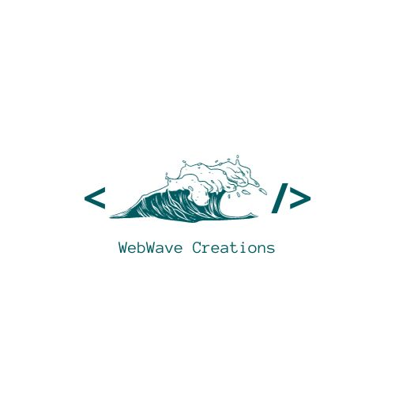
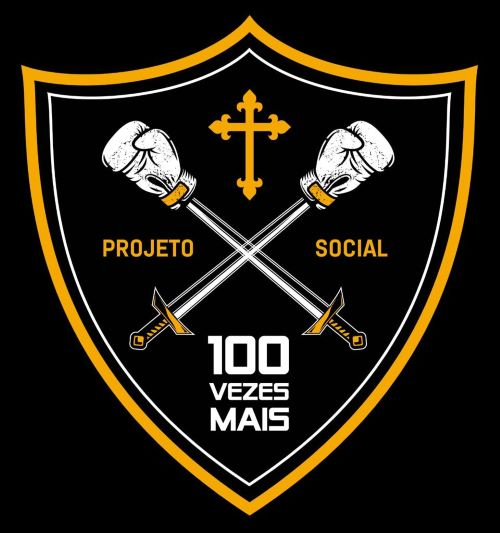

# FECAP - Fundação de Comércio Álvares Penteado

<p align="center">
<a href= "https://www.fecap.br/"></a>
</p>


## WWC - WebWave Creations 

<p align="center">

-
</p>

<b> Integrantes: </b>

<a href="https://www.linkedin.com/in/ana-flavia-lor%C3%AAdo-9629b5210?utm_source=share&utm_campaign=share_via&utm_content=profile&utm_medium=ios_app">Ana Flavia Lorêdo</a>
<br>
<a href="https://www.linkedin.com/in/eduardo-fraga-santos?utm_source=share&utm_campaign=share_via&utm_content=profile&utm_medium=android_app">Eduardo Fraga</a>
<br>
<a href="https://www.linkedin.com/in/gabriel-berto-167475141?utm_source=share&utm_campaign=share_via&utm_content=profile&utm_medium=ios_app">Gabriel Berto</a>
<br>
<a href="www.linkedin.com/in/nicolle-costa-a85100211">Nicolle Costa</a>
<br>
<a href="">Paulo Carvalho</a>


## Professores Orientadores: 

<a href="https://www.linkedin.com/in/adriano-valente-534576135/">Adriano Felix Valente</a>
<br>
<a href="https://www.linkedin.com/in/aimarlopes/">Aimar Martins Lopes</a>
<br>
<a href="https://www.linkedin.com/in/francisco-escobar/">Francisco Escobar</a>


## 💬 Descrição do Projeto

<p align="center">

-
</p>

O projeto Cem Vezes Mais tem a missão de, por meio do esporte, cultura e educação, ajudar na transformação de vidas e inclusão social de crianças, adolescentes e jovens de comunidades vulneráveis. Com a visão de resgatar sonhos e restabelecer a esperança de crianças, adolescentes e jovens em situação de vulnerabilidade, afim de oferecer-lhes um presente mais digno e um futuro mais promissor. <br>
Tendo esses motivos em vista, a aplicação produzida possui o objetivo de maximizar a disseminação de informações referentes ao projeto social, fazendo com que o mesmo possa alcançar uma maior visibilidade e fundos em prol da causa.


## 🛠️ Desenvolvimento

<b>Front-end</b>

- HTML: Estrutura do conteúdo da web.

- CSS: Estilização da página web.

- Bootstrap: Aprimoramento da aplicação.


<b>Back-end</b>

- Node.js: Ferramenta para a execução do JavaScript

- MySQL: Sistema de gerenciamento de base de dados.

- Docker: Plataforma para criação de ambientes isolados.

<b>UX/UI Design</b>

<a href="https://www.figma.com/file/4tmVlAvAYSVIkPdUMiU1Ph/Prot%C3%B3tipo-100X%2B?type=design&node-id=322-104&mode=design&t=qjlBxHsj15hDznlc-0">Protótipo</a>
<br>
<a href="https://www.figma.com/file/NftgAU3DyKo483b8sWWfc1/Wireframe-Cem-Vezes-Mais?type=design&node-id=0-1&mode=design&t=yMRMjLfpaybSV5wA-0">Wireframe</a>
<br>
<a href="https://drive.google.com/file/d/1dA7Nr2WhBEhJ9HYHmDwndE8d373P7Ljg/view?usp=sharing">Design System</a>


## 💻 Configuração para Desenvolvimento

1- Para abrir este projeto você necessita fazer a instalção das seguintes ferramentas:

-<a href="https://nodejs.org/en/blog/release/v16.13.0">NODE v16.13.0</a><br>
-<a href="https://dev.mysql.com/downloads/installer/">MySQL 8.0.34</a><br>
-<a href="https://docs.docker.com/engine/release-notes/24.0/">Docker v24.0.6</a>

2- Com o repositório do projeto, siga a instalação das seguintes dependências:

<b>Dependências:</b>
```sh
npm i express mysql dotenv hbs
npm i --save nodemon
npm i mysql12
npm i bcryptjs
npm i cookie-parser jsonwebtoken
npm i nodemailer
npm i path http
```
 3- Por fim, encontre o arquivo "app.js" e execute o arquivo no prompt com o comando e verifique que está no diretório do arquivo:
 
<b>Execução:</b>
```sh
node app.js
```

## 🗃 Histórico de lançamentos

* 0.0.1 - 09/09/2023
    * ATUALIZAÇÃO: Início do protótipo no figma.
* 0.1.0 - 21/09/2023
    * ATUALIZAÇÃO: Criação de páginas em HTML e CSS.
* 0.1.1 - 20/10/2023
    * ATUALIZAÇÃO: Páginas em HTML e CSS finalizadas e revisadas.
* 0.2.0 - 28/10/2023
    * Início do Back-end
    * MUDANÇA: Remoção de componentes.
* 0.2.1 - 03/11/2023
    * Finalizando Back-end
    * MUDANÇA: Reajuste de componentes.
* 0.3.0 - 10/11/2023
    * Revisão.  
    * Trabalho na reta final.
* 0.3.1 - 20/11/2023
    * Revisão.  
    * Trabalho finalizado.
 
 
## 🛠 Estrutura de pastas

-Raiz<br>
|<br>
|-->documentos<br>
  &emsp;|-->Design System.pdf<br>
  &emsp;|-->GRUPO 09 - Projetos de Extensão.pdf<br>
  &emsp;|-->PI_CemVezesMais.pdf<br>
|-->executáveis<br>
  &emsp;|-->windows<br>
  &emsp;|-->android<br>
  &emsp;|-->HTML<br>
|-->imagens<br>
|-->src<br>
  &emsp;|-->Backend<br>
  &emsp;|-->Frontend<br>
|readme.md<br>

A pasta raiz contem dois arquivos que devem ser alterados:

<b>README.MD</b>: Arquivo que serve como guia e explicação geral sobre seu projeto. O mesmo que você está lendo agora.

Há também 4 pastas que seguem da seguinte forma:

<b>documentos</b>: Toda a documentação estará nesta pasta.

<b>executáveis</b>: Binários e executáveis do projeto devem estar nesta pasta.

<b>imagens</b>: Imagens do sistema

<b>src</b>: Pasta que contém o código fonte.

## 📋 Licença/License


## 🎓 Referências

Aqui estão as referências usadas no projeto.

1. <https://www.npmjs.com/package/express>
2. <https://www.npmjs.com/package/handlebars-layouts>
3. <https://www.npmjs.com/package/bcrypt>
4. <https://www.npmjs.com/package/cookie-parser>
5. <https://www.npmjs.com/package/jsonwebtoken>
6. <https://www.npmjs.com/package/path>
7. <https://docs.docker.com/get-started/overview/>
8. <https://www.w3schools.com/mysql/mysql_sql.asp>

